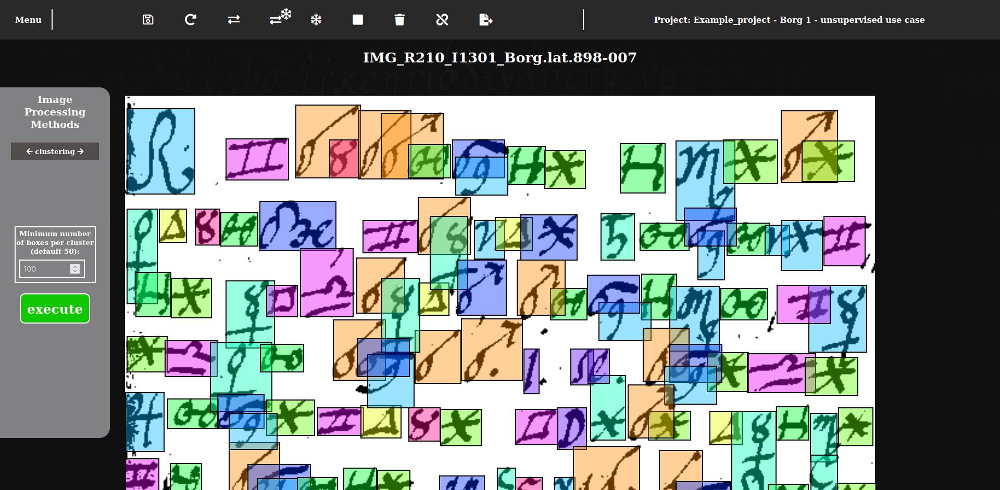
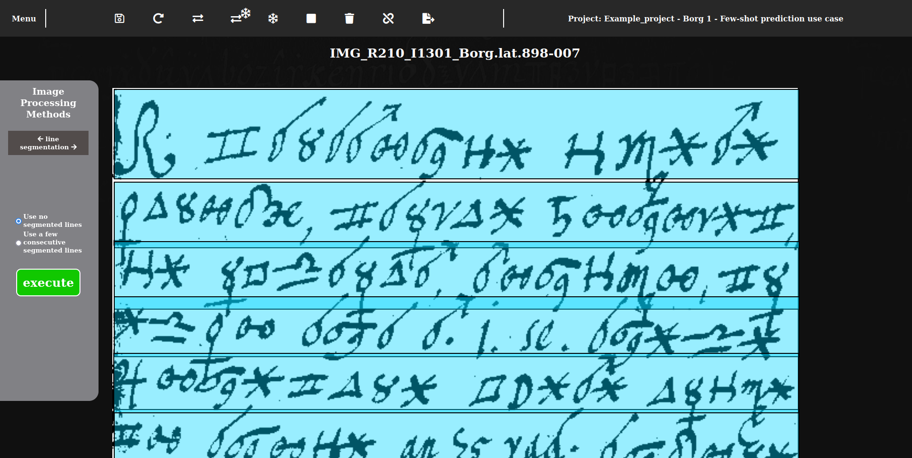
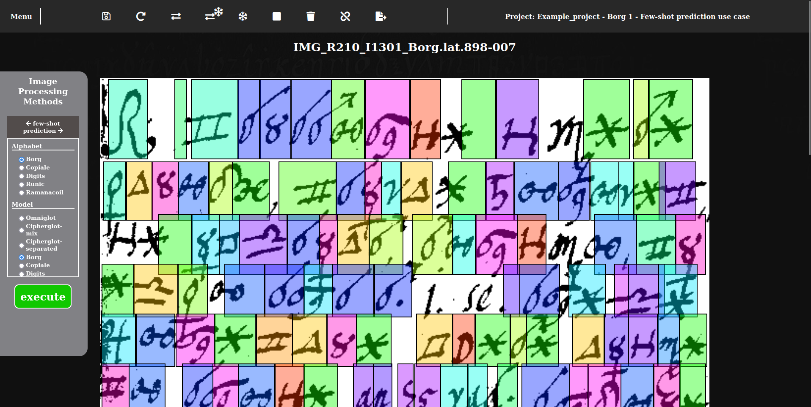
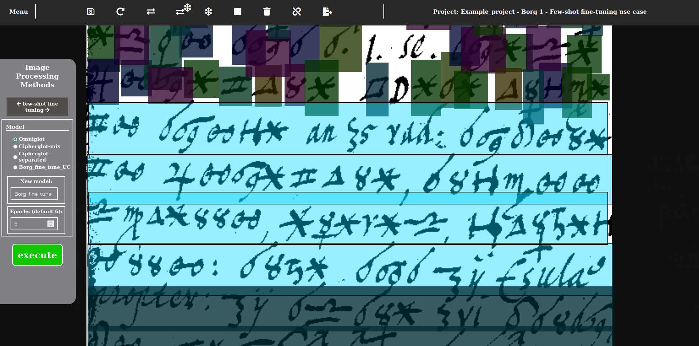

# TranscriptTool

The TranscriptTool is a web-based image processing tool enabling fast semi-automatic generation of transcription for digitalized historical documents. It provides an interactive user interface, but uses under the hood different image processing algorithms to segment lines and symbols, to cluster them or even to transcribe them given a pre-defined alphabet. The strength of TranscriptTool is in the fact that the user can intervene between the automatic image processing steps, correct the results and then continue and iterate until he arrives at the desired plain-text transcription of his documents.

This tool is part of a larger scientific effort: [DECRYPT project](https://de-crypt.org/) which aims to create an integrated, web-based pipeline of components covering all aspects of investigating historical ciphers. This includes: collection and digitalization of documents ([DECODE database](https://de-crypt.org/decrypt-web)), transcription of documents ([TranscriptTool](https://doi.org/10.3384/ecp188409)), analysis and decryption of documents ([CrypTool](https://www.cryptool.org/en/)) among others. See most [recent paper](https://doi.org/10.58009/aere-perennius0100) for the most up-to-date information.


*Decrypt pipeline (figure from the paper ["Supporting Historical Cryptology: The Decrypt Pipeline"](https://doi.org/10.58009/aere-perennius0100))*

It is possible to go through this process with manual effort (as attested to by centuries of historical work), but the DECRYPT project's goal is to accelerate and make easier this process by automatizing its critical steps. TranscriptTool as part of the project was created for this goal as well. Please see our [publication](https://doi.org/10.3384/ecp188409) on the TranscriptTool for more information (but please note that this repository presents the final version of TranscriptTool, the cited publication describes its work-in-progress state).

## Funding

This work as part of the [DECRYPT project](https://de-crypt.org/) has been funded by the Swedish Research Council grant 2018-06074, DECRYPT - Decryption of historical manuscripts.

## Related Work

Since the TranscriptTool is part of a larger project, it is connected and reliant in many ways on work of others. We would like to touch on them briefly here:

* **[DECRYPT project](https://de-crypt.org/) ([publication](https://doi.org/10.1080/01611194.2020.1716410)):** the Decrypt project commissioned the development of TranscriptTool.
* **[DECODE database](https://de-crypt.org/decrypt-web) ([publication](https://doi.org/10.3384/ecp188397)):** is responsible for storing and managing digitalized historical documents which serve as an input to the TranscriptTool.
* **[Few-shot algorithm](https://github.com/dali92002/HTRbyMatching) ([publication](https://doi.org/10.1016/j.patrec.2022.06.003)):** is one of the core image processing algorithms present in the TranscriptTool.
* **Unsupervised image processing algorithms ([publication](https://doi.org/10.1145/3322905.3322920)):** are likewise integral part of the TranscriptTool.
* **[CrypTool](https://www.cryptool.org/en/) ([publication](https://doi.org/10.3384/ecp188399), [book](https://ieeexplore.ieee.org/servlet/opac?bknumber=10361268), [bookchapter](https://de-crypt.org/Esslinger-017_Chap03-Historical-Cryptology.pdf)):** can make use of the plain-text transcription generated by the TranscriptTool to decrypt encrypted documents.
* **[CrypTool Transcriber & Solver](https://www.cryptool.org/en/ctts/) ([was used to transcribe Mary Stuart's letters](https://doi.org/10.1080/01611194.2022.2160677)):** was developed in parallel to TranscriptTool by George Lasry for fully-manual transcription. These two similar transcription tools were an inspiration to each other during their development.

There are also three student theses related to TranscriptTool:
* **[Lost in Transcription: Evaluating Clustering and Few-Shot learning for transcription of historical ciphers](https://www.diva-portal.org/smash/record.jsf?pid=diva2%3A1616686):** evaluates the Few-shot algorithm used in TranscriptTool. The focus is on prediction with trained models.
* **[Evaluating Transcription of Ciphers with Few-Shot Learning](https://uu.diva-portal.org/smash/record.jsf?pid=diva2%3A1671276):** evaluates the Few-shot algorithm through the TranscriptTool which at this point is still under development. The thesis' focus is on prediction with trained models.
* **[Evaluating and Fine-Tuning a Few-Shot Model for Transcription of Historical Ciphers](https://uu.diva-portal.org/smash/record.jsf?pid=diva2%3A1769071):** evaluates the Few-shot algorithm through the TranscriptTool which is almost in its final form. The thesis' focus is on fine-tuning pre-trained models through TranscriptTool and then predicting with those fine-tuned models.

## Acknowledgements

I would like to give thanks to the entire [DECRYPT](https://de-crypt.org/) team for their continuous support and feedback! Developing TranscriptTool would not have been possible without them! I am especially thankful to: Beáta Megyesi and Mihály Héder for their mentoring; Jialuo Chen and Mohamed Ali Souibgui for their contribution with image processing algorithms; Ingrid Eliasson and Nikolina Milioni for their thorough user testing; Alicia Fornés, Bernhard Esslinger, Nils Kopal, Michelle Waldispühl, Benedek Láng, George Lasry, Crina Tudor, Vasily Mikhalev, and Eva Pettersson for their helpful feedback.

## Cipher/Alphabet Support

TranscriptTool can work with any cipher or alphabet, but there are a few which has been tested by us thoroughly (see this [Master thesis](https://uu.diva-portal.org/smash/record.jsf?pid=diva2%3A1769071)):
* [Borg](https://www.su.se/english/research/research-projects/decipherment-of-historical-manuscripts/the-borg-cipher-1.688283),
* [Digit](https://doi.org/10.1080/01611194.2020.1755915),
* [Copiale](https://www.su.se/english/research/research-projects/decipherment-of-historical-manuscripts/the-copiale-cipher-1.688288),
* [Ramanacoil](https://doi.org/10.3384/ecp183156),
* [Runic](https://doi.org/10.1145/3519306).

Please note that the _Few-shot_ algorithms work with predefined alphabets which are only available for these 5 ciphers. The unsupervised image processing algorithms can work with any cipher however. Finally, the _segmentation_ algorithm has a predefined parameter setup for the Borg, Digit, and Copiale ciphers.

As an example in the README file, we will use some images from the Borg cipher (check [here](https://www.su.se/english/research/research-projects/decipherment-of-historical-manuscripts/the-borg-cipher-1.688283) for more information). See the [images](https://digi.vatlib.it/view/MSS_Borg.lat.898) on the Vatican library's website. All rights for the Borg images belong to the Vatican Library.

## Trained Few-shot Machine Learning Models

Please note that the folder `gpu/few_shot_train/models` is empty in this repository. This is where the trained Few-shot models would be located. Four of them are available for download from their author's, Mohamed Ali Souibgui, [repository](https://github.com/dali92002/HTRbyMatching).

## Workflow from the User's Perspective

Here we describe TranscriptTool from the user's perspective. It has four pages, or *views* how we call them:
* **Project View:** is the landing page. The user can here manage her project. She can create, delete, and rename saves, upload images, and export saves out of that project. She can also view the logs of the image processing.


*Project View with Ramanacoil ciphers.*

* **Pre-processing View:** is the first page where the user can go with "original" or unedited documents. She can here crop, rotate, and binarize the images to prepare them for the upcoming image processing.


*Pre-processing View on a Ramanacoil cipher binarized by the Niblack method.*

* **Image Processing View:** is responsible for the "heavy-lifting", for the automatic generating of bounding boxes around lines and symbols, for clustering (or grouping) those symbols into an alphabet, and even for generating plain-text transcription of lines. The user can however intervene and manually correct the generated outputs between different steps and she can also change the algorithm's parameters to fit and tune the processing to her documents.


*Image Processing View on a Copiale cipher processed by the Few-shot prediction method.*

* **Post-processing View:** gives the user the option to manually edit the generated results. She can here manage the bounding boxes, the clusters (or alphabet) and the transcription to correct any mistake. As such, she has a good control over the endresult of the workflow.


*Post-processing View on a Digit cipher.*

## Use Cases

Although the user is free to use the features provided by TranscriptTool in any order and combination, but we recommend three main ways of use or *use cases*. These use cases describe an end-to-end use of TranscriptTool: from the original images to plain-text transcription.

### Preliminary Set Up

The user must first set up a _project_, transfer or upload images into it, and then create at least one _save_ in order to be able to enter the processing views.

1. The user needs to create a _project_ (or enter an existing one). He can do that in the DECODE database and then enter into TranscriptTool with that project.


*Create a new project in the DECODE database.*

2. The user needs to add the images (which he intends to transcribe) to his project. There are two ways to do that:
  * by transferring images from the DECODE database into the project,
  * or by uploading images directly into the project (in TranscriptTool's _project view_).


*Transfer images from the DECODE database into TranscriptTool.*


*Upload images directly into TranscriptTool.*

3. The user needs to create a _save_ (or enter an existing one). From this point on he is in the TranscriptTool and needs not to interact with the DECODE database. He can create a new save by selecting the images he would like to include in that save.


*Create a new save with two Borg cipher images.*

These three steps conclude the minimum necessary set up for the _use cases_.

### Managing the Project

Beyond the _preliminary setup_, the user has different options to manage his project. See an overview in the following figure.

*Please note that both exporting and importing a save has the same zip format. We recommend only importing zip files into TranscriptTool which were exported out from it. We do not recommend changing anything manually in the exported zip file, as then a later import might fail.*


*Overview of project management options in the **project view**.*

### Unsupervised Use Case

In this use case, the user uses different unsupervised image processing algorithms to accelerate and ease his transcription work.


*Unsupervised Use Case*

1. **Preprocess images (_pre-processing view_):** the user crops, rotates, and binarizes the images he would like to transcribe.


*One page of the Borg cipher after pre-processing.*

2. **Segment symbols (_image processing view_):** the user runs the _segmentation_ algorithm. He may change input parameters if needed. The result is bounding boxes around symbols.


*Result of the segmentation algorithm with the Borg cipher parameter setup.*

3. **Manually correct the output (_image processing view_):** the user moves around and resizes the incorrect bounding boxes. He can also add or remove some.


*After manual correction of the bounding boxes.*

4. **Cluster symbols (_image processing view_):** the user runs the _clustering_ algorithm. He may change input parameters if needed. As a result the bounding boxes are grouped into clusters which will constitute an alphabet once transcription is ordered to them.


*Result of the clustering algorithm based on the manually corrected bounding boxes.*

5. **Correct and transcribe (_post-processing view_):** the user clears up the clusters by moving the bounding boxes between clusters to create for each different symbol a single cluster. He can also create and remove clusters to achieve this. During the cleaning process he also assign a transcription to each cluster. Once he reaches the desired result, he can export out the project which will produce a plain-text file for each image with the line-by-line transcription.


*After manual correction of the clusters and transcribing them.*


*The first few lines of the generated line-by-line plain-text transcription.*

6. **(optional) Propagate labels (_image processing view_):** the user runs the _label propagation_ algorithm after he made some progress in the previous step. This algorithm will improve the existing clustering based on the previous manual effort. The user may change input parameters if needed. As a result the bounding boxes are better grouped into clusters. The user need to resume and complete the previous step after this.


*Result of the label propagation algorithm based on the manually corrected clusters (second half of the image).*

### Few-shot Prediction Use Case

In this use case, the user uses the Few-shot prediction algorithm to accelerate and ease his transcription work. Please note that this algorithm works only with a predefined set of alphabets (Borg, Digit, Copiale, Ramanacoil, and Runic).


*Few-shot Prediction Use Case*

1. **Preprocess images (_pre-processing view_):** the user crops, rotates, and binarizes the images he would like to transcribe.


*One page of the Borg cipher after pre-processing.*

2. **Segment lines (_image processing view_):** the user runs the _lines segmentation_ algorithm. He may change input parameters if needed. The result is bounding boxes around lines. The user needs to manually correct any mistake before moving on to the next step.


*Result of the line segmentation algorithm after some manual correction.*

3. **Predict symbols on all lines (_image processing view_):** the user runs the _few-shot prediction_ algorithm. He may change input parameters if needed. As a result the symbol's bounding boxes, clusters, and transcription are generated (including line-by-line plain-text transcription).


*Result of the Few-shot prediction algorithm with the model trained on the Borg cipher.*

4. **Manually correct the output (_post-processing view_):** the user moves around and resizes the incorrect bounding boxes. In parallel, he clears up the clusters by moving the bounding boxes between clusters to create for each different symbol a single cluster. Since we rely on a predefined alphabet here, there is no need to add or remove clusters in general. Once the user reaches the desired result, he can export out the project which will produce a plain-text file for each image with the line-by-line transcription. Please note that there will be two set of transcription files in the export: one is the output of the Few-shot algorithm, and the other is what the _post-processing view_ generated based on the user's corrections.


*After manual correction of the Few-shot prediction output.*


*The first few lines of the two generated line-by-line plain-text transcription.*

### Few-shot Fine-tuning Use Case

In this use case, the user uses iteratively the Few-shot prediction and fine-tuning algorithms to accelerate and ease his transcription work. Please note that these algorithms work only with a predefined set of alphabets (Borg, Digit, Copiale, Ramanacoil, and Runic).


*Few-shot Fine-tuning Use Case*

1. **Preprocess images (_pre-processing view_):** the user crops, rotates, and binarizes the images he would like to transcribe.


*One page of the Borg cipher after pre-processing.*

2. **Segment lines (_image processing view_):** the user runs the _lines segmentation_ algorithm. He may change input parameters if needed. The result is bounding boxes around lines. The user needs to manually correct any mistake before moving on to the next step.


*Result of the line segmentation algorithm after some manual correction.*

3. **Predict symbols on a few lines (_image processing view_):** the user runs the _few-shot prediction_ algorithm but only on the first few lines. He can achieve this by _freezing_ the other lines (image processing will not touch the _frozen_ lines). He may change input parameters if needed. As a result the symbol's bounding boxes, clusters, and transcription are generated.


*Result of the Few-shot prediction algorithm with the Omniglot model (generic model, trained on different ciphers). Note that the line at the bottom is "frozen".*

4. **Manually correct the output (_post-processing view_):** the user moves around and resizes the incorrect bounding boxes. In parallel, he clears up the clusters by moving the bounding boxes between clusters to create for each different symbol a single cluster. Since we rely on a predefined alphabet here, there is no need to add or remove clusters in general. Once the user reaches a clean enough result, he can move on to the next step.


*After manual correction of the Few-shot prediction output.*

5. **Fine-tune model (_image processing view_):** the user runs the _few-shot fine tuning_ algorithm but only on the corrected few lines. He may change input parameters if needed. As a result he will have a new fine-tuned model in his project which is specifically fine-tuned on his document.


*The resulting fine-tuned model "Borg_fine_tune_UC" appears in the list of available models.*

6. **Iterate steps 3 to 5 until a desired result is reached:** the user uses from this point on his fine-tuned model and iteratively predicts the next few lines, corrects the output, and further fine-tunes his model. To achieve this he needs to _freeze_ after the fine-tuning the corrected symbols and _unfreeze_ the next few lines before a prediction step. In a similar way, he needs to _unfreeze_ all corrected symbols and _freeze_ any lines before a fine-tuning step since we would like to always use all available data for the training process. After 1-3 iterations the user's model should work well enough to predict on all the remaining lines with good accuracy thus reducing the amount of the necessary manual correction.


*"Freezing" the already corrected lines and "unfreezing" the next four lines.*


*Result of the Few-shot prediction algorithm with the new "Borg_fine_tune_UC" model on the next four lines.*


*After manual correction of the previous Few-shot prediction output.*


*After fine-tuning for the second time and predicting on the remaining lines.*


*The last few lines of the Few-shot generated line-by-line plain-text transcription. Note that this was not corrected manually, so this result can be improved by some manual effort.*

## High Level Walkthrough of Infrastructure Setup

The TranscriptTool relies on a fairly simple infrastructure. Its webservice runs on a Linux web server and its GPU-enabled image processing is located in a different Linux machine. The webservice communicates with the remote GPU-server via SSH. Most of the data is stored on the web server, apart from fine-tuned
Few-shot models nothing needs to be stored permanently on the GPU-server.

If you would like to set up such an infrastructure, please follow these step:
1. Set up an Apache web server (with gd and ssh2 libraries) on a Linux machine (probably virtual machine).
2. Create the necessary python virtual environment from `miscellaneous/tr_requirements.txt`.
3. Create `web/config/config.php` from `web/config/config_example.php`, and follow the instructions given there.
4. Create `web/config/config.js` from `web/config/config_example.js`, and follow the instructions given there.
5. Copy the contents of the repository except for the `gpu` folder into a folder accessible to the web server.
6. Set up the GPU server on a Linux machine with GPU (probably virtual machine). Please note that we although call this a _GPU server_ it does not actually have to be a web server, it only needs to have its SSH port open.
7. Add the public key, which the web server will use to connect, to the GPU server.
8. Address the GPU related todo-s in the `gpu/gpu_image_processing_wrapper.py`.
9. Create the necessary python virtual environment on the GPU server from `gpu/few_shot_train/htrmatching.yml`.
10. Copy the contents of the `gpu` folder to the GPU server.
11. You are more or less ready to go! You can also take a look at the `Dockerfile` for helpful information since the local setup is quite similar to this.

The code has been implemented & tested with two separate Python environments:
* Python 3.9.12 in `async_kmeans.py`, `async_label_propagation.py`, `async_segmentation.py`, `datech_line_segmentation.py`, `image_processing_wrapper.py`, and `binarize.py`.
* Python 3.7.11 and PyTorch 1.7.1 in `gpu/**/*.py`.

The code has been tested with Firefox (version ~120) and Chrome (version ~119).

## Local Deployment 

You only need to have [`Docker`](https://docs.docker.com/get-docker/) installed to be able to easily create a local deployment. See the `Dockerfile` for more information. Please run the following command to build and start the local deployment:
```bash
# use sudo if needed
docker-compose up --build
```

Please note that the this command might take up to _20 minutes_ (or more) to complete, but it can also finish earlier than that.

Once the docker container runs, the TranscriptTool will be available under: `http://localhost:8080/web/`.

If you have already built the container once and you did not change the code then you only need to start it up:
```bash
# use sudo if needed
docker-compose up
```

If you would like to check something inside the container, use this command to open up a shell inside it:
```bash
# use sudo if needed
docker exec -it transcripttool /bin/bash
```

If you would like to exit the local deployment, open a new terminal and run the following command:
```bash
# use sudo if needed
docker-compose down
```

Please note that we do not provide any images, you have to provide them yourself. If you do not have any suitable images you could go to the [DECODE database](https://de-crypt.org/decrypt-web) or to the Vatican Library's [website](https://digi.vatlib.it/) (see in particular the [Borg ciphers](https://digi.vatlib.it/view/MSS_Borg.lat.898)).

## Demo Version (discontinued)

Please note that we do not maintain anymore the [demo](https://de-crypt.org/transcript-tool-demo/) version of the TranscriptTool.

## Folder Structure

```bash
├── documentation (images for README.md)
├── gpu (on the GPU-server)
│   ├── few_shot_train (Few-shot prediction and fine-tuning algorithms)
│   │   ├── **/*.py
│   ├── temp (Few-shot results are stored here temporarily before transmitted back to the web server)
│   ├── user_models (both the pre-trained and user models are stored here)
│   │   ├── **/*.pth
│   └── gpu_image_processing_wrapper.py
├── images
├── libs (external dependencies, like jQuery and XState.js)
├── miscellaneous
├── user_projects (on the web server, the users' projects are stored here)
├── web (on the web server)
│   ├── config (configs for the frontend and the backend)
│   │   ├── **/*.js
│   │   ├── **/*.php
│   ├── image_processing_view
│   │   ├── **/*.py (unsupervised image processing algorithms)
│   │   ├── **/*.css
│   │   ├── **/*.js
│   │   ├── **/*.php
│   ├── post_processing_view
│   │   ├── **/*.css
│   │   ├── **/*.js
│   │   ├── **/*.php
│   ├── pre_processing_view
│   │   ├── **/*.py (binarization algorithms)
│   │   ├── **/*.css
│   │   ├── **/*.js
│   │   ├── **/*.php
│   ├── project_view (index.php (below) loads it in)
│   │   ├── **/*.css
│   │   ├── **/*.js
│   │   ├── **/*.php
│   │   ├── **/*.json (templates for the internal data structures)
│   ├── utils_css
│   │   ├── **/*.css
│   ├── utils_js
│   │   ├── **/*.js
│   ├── utils_php
│   │   ├── **/*.php
│   └── index.php (entry point of TranscriptTool, loads in the "project view")
└── .gitignore, Dockerfile, README.md, ...
```

## Data Structure

TranscriptTool does not have a database on its own, it stores its user data in a folder structure on the web server under `user_projects`. Inside this folder each folder corresponds to one _project_ and inside each project there are folders which store the _save_-s inside that project. See an example in `user_projects/example_project`, this is the "trimmed down" version (we removed all images except for the thumbnails from it) of the project from the "Use Cases" section.

```bash
project_1
├── **/*.png and **/*.jpg (the images added to the project)
├── project_lookup_table.json (contains book-keeping data of the project, for example, information on the associated fine-tuned models)
├── thumbnails (generated low-quality thumbnails of the images)
│   ├── **/*.png and **/*.jpg
├── save_1 (a save inside the project)
│   ├── **/*.png and **/*.jpg (the images added to the save, this is a subset of the images in the project)
│   ├── bounding_boxes.json (contains the coordinates and clusters id-s of the symbol bounding boxes and the coordinates of the line bounding boxes)
│   ├── transcription.json (contains the cluster id to transcription mapping, and also the associated color)
│   ├── lookup_table.json (similar to the project lookup table, but for the save)
│   ├── generated_transcription.json (line-by-line plain-text transcription with line coordinates generated by the Few-shot prediction algorithm)
│   ├── post_processed_transcription.json (image-by-image plain-text transcription generated by the "post-processing view" page)
│   ├── log.txt (contains the logs for the save which appear in the "project view" page)
└── save_2 ...

project_2 ...
├── save_1 ...
└── save_2 ...
```

The main "data stores" of any save are the `bounding_boxes.json` and `transcription.json` files since they contain all the necessary information to locate the bounding boxes on the image and to map the transcription to them. Concerning the internal structure of these files, please see their JSON schema-s: `user_projects/decrypt-schema-bounding-boxes.json` and `user_projects/decrypt-schema-transcription.json`.


*Inside the "example_project" from the "Use Cases" section.*


*Inside the "Borg 1 - Few-shot prediction use case" in the "example_project" from the "Use Cases" section.*

## License

We offer this repository with the Apache 2.0 license, please see the `LICENSE`.

Please note however that some of its dependencies have a more restrictive license:
* Conda (in `Dockerfile`) since we use channels other than _conda-forge_ in `gpu/few_shot_train/htrmatching.yml`.
* See the different external dependencies in folder `libs/`, you will also find their license file in their respective folder.

## Cite

If you use our implementation, please cite:
```
@inproceedings{szigeti2022transcript,
  title={The TRANSCRIPT Tool for Historical Ciphers by the DECRYPT Project},
  author={Szigeti, Ferenc and H{\'e}der, Mih{\'a}ly},
  booktitle={International Conference on Historical Cryptology},
  pages={208--211},
  year={2022}
}
```

